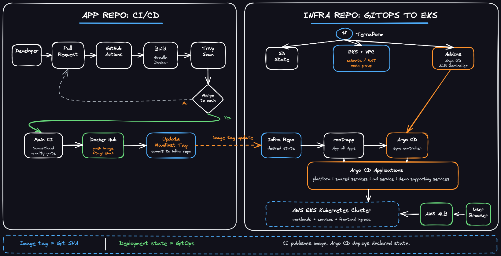
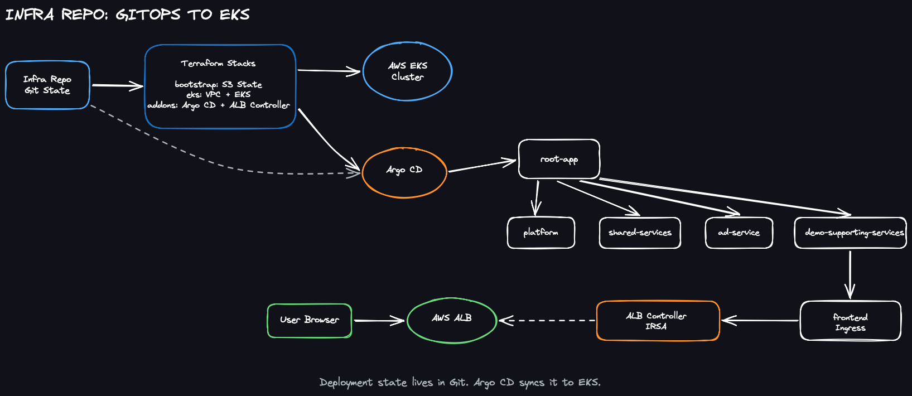

# E-Commerce DevOps Infrastructure

## Overview

This repository contains the infrastructure, Kubernetes manifests, and GitOps deployment configuration for my E-Commerce DevOps implementation project.

The project is based on the OpenTelemetry Demo. I selected several microservices from the original demo and rebuilt the deployment workflow with a DevOps-focused approach, including Infrastructure as Code, Kubernetes deployment, Argo CD GitOps, and AWS EKS.

The project uses a two-repository design:

- `e-commerce-devops-app`: application source code, Dockerfiles, GitHub Actions workflows, image build, image scan, and image publishing
- `e-commerce-devops-infra`: Terraform infrastructure code, Kubernetes manifests, Argo CD Applications, and GitOps desired state

This separation keeps application delivery and infrastructure management independent, which is closer to a real-world DevOps / GitOps workflow.

## Current Scope

The current implementation focuses on the Ad Service as the first completed service.

Completed for Ad Service:

- Docker image build in the application repository
- GitHub Actions CI workflow
- Docker image scan with Trivy
- Image publishing with SHA-based tags
- Kubernetes Deployment and Service manifests
- GitOps deployment to AWS EKS through Argo CD

Product Catalog Service and Recommendation Service are planned as the next services to be added following the same workflow.

In addition to the selected core services, several supporting services from the OpenTelemetry Demo are deployed so that the demo application can run end to end.

## Architecture



In this design, CI is responsible for building and publishing immutable container images. The infrastructure repository stores the desired Kubernetes deployment state. Argo CD continuously synchronizes the desired state from Git to the EKS cluster.

## Repository Structure

```text
argocd/
  root-app.yaml
  applications/
    platform.yaml
    shared-services.yaml
    ad-service.yaml
    demo-supporting-services.yaml

kubernetes/
  platform/
    namespace.yaml
    serviceaccount.yaml
  shared-services/
    flagd/
  core-services/
    ad/
  demo-supporting-services/
    frontend/
    frontendproxy/
    cart/
    checkout/
    payment/
    shipping/
    ...

terraform/
  bootstrap/
    # Creates the S3 backend for Terraform remote state
  eks/
    # Creates VPC, subnets, NAT Gateway, EKS cluster, node group, and EKS addons
  addons/
    # Installs Argo CD and AWS Load Balancer Controller

scripts/
  bootstrap.sh
  destroy.sh
```

## Terraform Design

The Terraform code is split into multiple stacks.

### `terraform/bootstrap`

Creates the S3 bucket used as the remote backend for Terraform state.

### `terraform/eks`

Creates the core AWS infrastructure:

- VPC
- Public and private subnets
- NAT Gateway
- EKS cluster
- Managed node group
- EKS managed addons

### `terraform/addons`

Installs cluster-level addons:

- Argo CD
- AWS Load Balancer Controller

The addons stack reads required outputs from the EKS stack through Terraform remote state.

## GitOps Design



Argo CD is configured with the App of Apps pattern.

```text
root-app
  -> platform
  -> shared-services
  -> ad-service
  -> demo-supporting-services
```

This design allows the root Argo CD Application to manage multiple child Applications from Git.

Current sync order:

```text
platform             wave 0
shared-services      wave 1
ad-service           wave 2
demo-supporting      wave 2
```

## AWS Load Balancer Controller

AWS Load Balancer Controller is installed through Terraform using Helm.

It is configured with IRSA so that the controller can access AWS APIs through a dedicated IAM role instead of using broad node-level permissions.

The controller watches Kubernetes Ingress resources and creates the corresponding AWS ALB resources.

The frontend is exposed through an ALB-backed Ingress.

## Bootstrap

To create the environment:

```bash
./scripts/bootstrap.sh
```

The bootstrap script performs the following steps:

```text
1. Apply the EKS Terraform stack
2. Update local kubeconfig
3. Wait for worker nodes to become Ready
4. Apply the addons Terraform stack
5. Wait for the Argo CD Application CRD
6. Apply the Argo CD root application
7. Wait for the ALB address
```

## Cleanup

To destroy the environment:

```bash
./scripts/destroy.sh
```

The destroy script cleans up resources in the following order:

```text
1. Patch Argo CD Applications with cascading delete finalizers
2. Delete Argo CD Applications
3. Delete and wait for the frontend Ingress
4. Destroy the addons Terraform stack
5. Destroy the EKS Terraform stack
```

This order is important because the AWS Load Balancer Controller must still be running when the Ingress is deleted. Otherwise, ALB-related AWS resources such as Security Groups may remain and block VPC deletion.

## Verification

Useful verification commands:

```bash
kubectl get applications -n argocd
kubectl get deploy -n e-commerce-devops
kubectl get pods -n e-commerce-devops
kubectl get svc -n e-commerce-devops
kubectl get ingress -n e-commerce-devops
```

Check external access:

```bash
curl -I http://<alb-dns-name>
```

Check AWS cleanup:

```bash
terraform -chdir=terraform/eks state list
terraform -chdir=terraform/addons state list
aws eks list-clusters --region ap-northeast-1
```

## Tech Stack

- AWS
- Amazon EKS
- Terraform
- Kubernetes
- Argo CD
- Helm
- AWS Load Balancer Controller
- Docker
- GitHub Actions
- Trivy
- GitOps
